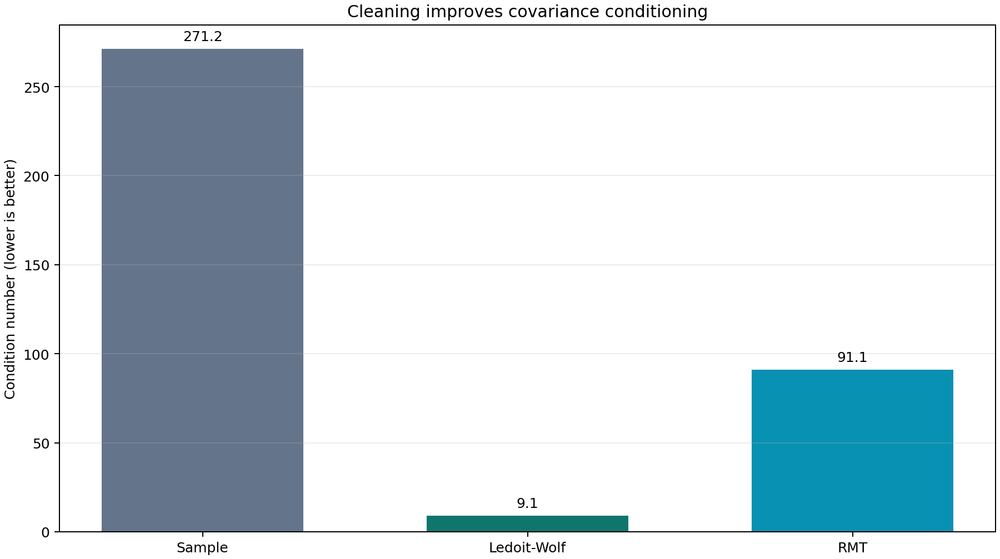
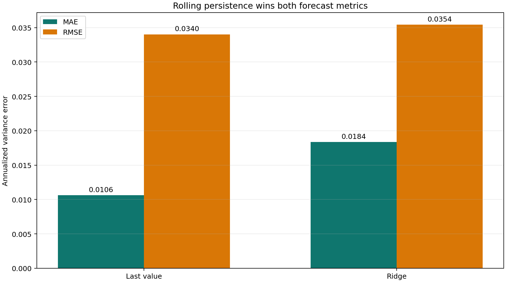
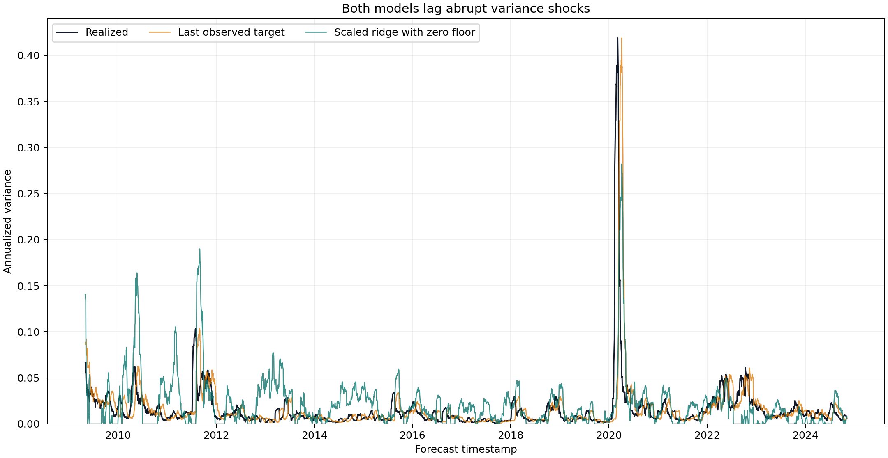

Le nettoyage d'une covariance répond à un vrai problème. Une matrice de
covariance bruitée peut rendre un portefeuille de variance minimale ou un ratio
de couverture instable. J'ai voulu tester une affirmation plus exigeante : les
diagnostics tirés d'une matrice nettoyée aident-ils à prévoir la variance réalisée
du mois suivant ?

J'ai mené l'expérience sur huit fonds négociés en bourse (ETF) entre 2008 et
2024. Un benchmark glissant fondé sur la dernière cible observable l'emporte. Par
rapport à lui, la régression ridge standardisée augmente l'erreur absolue moyenne
(MAE) de 73,0 % et la racine de l'erreur quadratique moyenne (RMSE) de 4,2 %. Le
nettoyage améliore nettement le conditionnement de la matrice. Ces sept features
issues des matrices nettoyées n'améliorent pas la prévision.


Cette distinction est le sujet de l'étude. Le conditionnement mesure la réaction
d'une matrice à de petites variations des données. La prévision demande si la
matrice d'aujourd'hui contient de l'information sur des rendements encore
inconnus. Les deux propriétés ne vont pas forcément ensemble.

## L'objet à estimer

Soit $P_{i,t}$ le cours de clôture ajusté de l'actif $i$ au jour de bourse $t$.
Son rendement logarithmique, exprimé en décimal par jour, est

$$
r_{i,t}=\log\left(\frac{P_{i,t}}{P_{i,t-1}}\right).
$$

Plaçons $T$ observations quotidiennes de $N$ actifs dans la matrice de rendements
$R$. Soit $\bar R$ une matrice dont chaque ligne répète les moyennes des colonnes
de $R$. La covariance empirique vaut

$$
S=\frac{1}{T-1}(R-\bar R)^\top(R-\bar R).
$$

Chaque élément $S_{ij}$ s'exprime en rendement quotidien au carré. L'expérience
utilise $T=63$ observations et $N=8$ ETF : EEM, GLD, HYG, IWM, QQQ, SPY, TLT et
VNQ. La matrice est inversible, mais ce critère est peu exigeant. L'erreur
d'échantillonnage peut encore déplacer les petites valeurs propres au point de
rendre l'inverse instable.

Pour une covariance symétrique définie positive, le nombre de conditionnement est

$$
\kappa(S)=\frac{\lambda_{\max}(S)}{\lambda_{\min}(S)},
$$

où $\lambda_{\max}(S)$ et $\lambda_{\min}(S)$ sont les plus grande et plus petite
valeurs propres. Ce ratio n'a pas d'unité. Une valeur élevée signale qu'un calcul
fondé sur l'inverse peut changer fortement après une faible perturbation des
rendements.

## Deux méthodes de nettoyage

Le shrinkage de Ledoit-Wolf mélange la covariance empirique avec une cible
structurée. L'intensité du shrinkage est estimée à partir des données plutôt que
choisie manuellement. La méthode accepte un peu de biais afin de réduire la
variance d'estimation.

L'estimateur issu de la théorie des matrices aléatoires (RMT, pour *random matrix
theory*) travaille sur les corrélations. Écrivons
$D=\operatorname{diag}(\sigma_1,\ldots,\sigma_N)$, où $\sigma_i$ est la volatilité
quotidienne empirique de l'actif $i$. La corrélation empirique est

$$
C=D^{-1}SD^{-1}.
$$

Contrairement à la covariance, la corrélation n'a pas d'unité. Sa décomposition
spectrale s'écrit $C=V\Lambda V^\top$, où $V$ contient les vecteurs propres et
$\Lambda=\operatorname{diag}(\lambda_1,\ldots,\lambda_N)$ les valeurs propres.

Le résultat de Marchenko-Pastur décrit la distribution asymptotique des valeurs
propres d'une grande covariance empirique construite à partir d'un bruit
indépendant et identiquement distribué. Définissons $q=T/N$. Pour un bruit de
variance unitaire, la borne supérieure du spectre est

$$
\lambda_+=\left(1+q^{-1/2}\right)^2.
$$

Ici, $q=63/8=7.875$ et $\lambda_+=1.8397$. L'implémentation classe comme bruit
toute valeur propre telle que $\lambda_i\leq\lambda_+$, remplace ces valeurs par
leur moyenne, reconstruit une corrélation à diagonale unitaire, puis revient à la
covariance :

$$
\widetilde S=D\widetilde C D.
$$

```python
eigenvalues, eigenvectors = np.linalg.eigh(sample_correlation.to_numpy())
aspect_ratio = len(returns_window) / returns_window.shape[1]
lambda_plus = (1.0 + aspect_ratio**-0.5) ** 2

noise_mask = eigenvalues <= lambda_plus
eigenvalues[noise_mask] = eigenvalues[noise_mask].mean()
cleaned = eigenvectors @ np.diag(eigenvalues) @ eigenvectors.T
```

Ce seuil est une règle de filtrage, pas un modèle littéral des rendements d'ETF.
Les rendements sont hétéroscédastiques, corrélés entre eux et dépendants dans le
temps. De plus, $N=8$ reste loin d'un cadre asymptotique de grande dimension. La
renormalisation de la matrice reconstruite modifie aussi légèrement son spectre.
RMT est donc une heuristique utile ici, pas une vérité de référence.

Sur la dernière fenêtre de 63 jours, le nombre de conditionnement de la covariance
empirique est 271,2. Ledoit-Wolf le ramène à 9,1 et RMT à 91,1.



Le graphique soutient une affirmation précise : les deux méthodes améliorent le
conditionnement sur cette fenêtre, et Ledoit-Wolf agit plus fortement. Il ne
prouve ni une meilleure prévision de covariance ni une meilleure performance de
portefeuille.

## De la matrice aux sept prédicteurs

Pour chaque fenêtre glissante de 63 jours, le pipeline enregistre sept
prédicteurs :

- la corrélation empirique moyenne entre les paires d'actifs ;
- les nombres de conditionnement des covariances empirique, Ledoit-Wolf et RMT ;
- chaque nombre nettoyé divisé par le nombre de la covariance empirique ;
- la volatilité annualisée sur 21 jours d'un portefeuille équipondéré et rééquilibré chaque jour.

La construction du rendement du portefeuille demande un peu de soin. La moyenne
des rendements logarithmiques des actifs n'est qu'une approximation du rendement
d'un portefeuille équipondéré. Le code transforme d'abord chaque rendement
logarithmique en rendement simple, calcule la moyenne de ces rendements simples,
puis revient au logarithme. Si $N$ est le nombre d'actifs,

$$
r_{p,t}=\log\left(1+\frac{1}{N}\sum_{i=1}^{N}\left(e^{r_{i,t}}-1\right)\right).
$$

La variable à prévoir est la variance réalisée future annualisée sur $h=21$
jours de bourse :

$$
RV_{t,h}=\frac{252}{h}\sum_{j=1}^{h}r_{p,t+j}^{2}.
$$

$RV_{t,h}$ est une variance, pas une volatilité. Son unité est donc le rendement
annualisé au carré. Le prédicteur retardé est une volatilité, exprimée en unités
de rendement annualisé. Un modèle de régression peut accepter cette différence,
mais il faut mettre les variables à l'échelle avant de leur appliquer une
pénalité ridge commune.

## La règle temporelle qui élimine la fuite des cibles

Une feature datée de $t$ utilise les rendements connus jusqu'à $t$. Sa cible
utilise ceux de $t+1$ à $t+21$ et ne devient observable qu'à $t+21$. Un simple
ordre chronologique entre apprentissage et test ne suffit donc pas. À la première
date du test, les 20 dernières cibles qui la précèdent sont encore incomplètes.

Le code walk-forward corrigé purge ces labels indisponibles. Le premier fold
contient 252 cibles d'apprentissage observées, 20 dates de cibles purgées et 21
lignes de test. Le modèle avance ensuite de 21 lignes et conserve tout
l'historique devenu observable.

```python
test_start = config.min_train_size + config.target_horizon_days - 1
while test_start + config.test_size <= sample_count:
    train_stop = test_start - config.target_horizon_days + 1
    train_slice = slice(0, train_stop)
    test_slice = slice(test_start, test_start + config.test_size)
    slices.append((train_slice, test_slice))
    test_start += config.step_size
```

On obtient 186 folds et 3 906 prévisions hors échantillon entre mai 2009 et
novembre 2024. Les cibles de deux dates adjacentes partagent 20 rendements sur 21.
Les erreurs agrégées sont donc descriptives. Des erreurs-types fondées sur
l'indépendance des observations seraient trompeuses.

## Benchmark et modèle ridge

Le benchmark est mis à jour à chaque date de test. À la date $t$, il utilise la
cible datée de $t-21$, dont le dernier rendement vient d'être observé. Il dispose
donc de la même information et profite de la persistance de la volatilité. Figer
sa valeur pendant un bloc entier de 21 jours donnerait de nouvelles features
quotidiennes au modèle tout en refusant au benchmark les nouvelles observations.

Le second modèle est une régression ridge. Dans chaque fold, le prédicteur $j$ est
standardisé uniquement avec la moyenne $\mu_j$ et l'écart-type $s_j$ de
l'échantillon d'apprentissage :

$$
z_{k,j}=\frac{x_{k,j}-\mu_j}{s_j},
$$

où $x_{k,j}$ est le prédicteur $j$ de l'observation d'apprentissage $k$. Ridge
estime l'ordonnée à l'origine $\beta_0$ et le vecteur de coefficients $\beta$ en
minimisant

$$
\sum_{k=1}^{M}\left(y_k-\beta_0-z_k^\top\beta\right)^2
+\alpha\sum_{j=1}^{7}\beta_j^2,
$$

où $M$ est le nombre d'observations d'apprentissage, $y_k$ la variance réalisée,
$z_k$ le vecteur de features standardisées et la pénalité fixe $\alpha=1$. La
standardisation est nécessaire : certains nombres de conditionnement atteignent
plusieurs centaines, alors que la volatilité retardée est un nombre décimal. Sans
elle, la pénalité traite les coefficients différemment sans raison économique.

Un modèle linéaire sans contrainte peut prévoir une variance négative. Le pipeline
applique donc une contrainte économique fixée avant l'évaluation :

$$
\widehat{RV}_{t,h}=\max\left(0,\widehat{RV}^{\mathrm{raw}}_{t,h}\right).
$$

Le scaler, la régression et le plancher à zéro sont identiques dans chaque fold.
Aucun paramètre n'a été choisi à partir des résultats de test.

## La persistance glissante l'emporte

Pour $K$ prévisions hors échantillon, soit $y_k$ la variance réalisée et
$\hat y_k$ sa prévision. Les deux fonctions de perte sont

$$
\operatorname{MAE}=\frac{1}{K}\sum_{k=1}^{K}|y_k-\hat y_k|
$$

et

$$
\operatorname{RMSE}=\sqrt{\frac{1}{K}\sum_{k=1}^{K}(y_k-\hat y_k)^2}.
$$

Toutes deux s'expriment en unités de variance annualisée. La RMSE pénalise plus
fortement les grandes erreurs puisqu'elle élève chaque écart au carré.

| Modèle | MAE | RMSE |
|---|---:|---:|
| Dernière cible observable glissante | 0.01061 | 0.03401 |
| Ridge standardisé avec plancher à zéro | 0.01835 | 0.03543 |



Ridge perd sur les deux mesures. L'écart de MAE, 73,0 %, est large ; celui de RMSE,
4,2 %, est étroit. La mise au carré réduit la différence parce que les deux
modèles ratent les chocs brusques de variance. Le choix de la fonction de perte
reste important pour l'interprétation économique, mais il ne change pas le
classement dans cet échantillon.



La série temporelle explique les écarts. Les deux prévisions réagissent
en retard aux chocs brusques. Ridge produit aussi de faux positifs et atteint son
plancher à zéro dans 784 prévisions sur 3 906, soit 20,1 % de l'échantillon. Ces
erreurs sur les dates ordinaires dégradent la MAE. Aucun des deux modèles
n'anticipe les variances de crise de façon fiable, ce qui resserre l'écart de RMSE.

## Ce que l'expérience démontre, et ce qu'elle ne démontre pas

Le résultat sur le conditionnement et la victoire du benchmark résistent à
l'audit, mais pas l'implémentation initiale. Il a fallu purger les labels
indisponibles, reconstruire exactement les rendements du portefeuille,
standardiser les prédicteurs, borner les prévisions de variance à zéro et mettre
le benchmark à jour à la même fréquence quotidienne que le modèle. La fréquence
à laquelle le plancher s'active montre aussi que ridge linéaire représente mal la
forme de la variance conditionnelle.

Le test n'isole toujours pas la contribution propre du débruitage. Ridge reçoit
ensemble les diagnostics empiriques, les diagnostics nettoyés, leurs ratios et la
volatilité retardée. Une étude d'ablation devrait comparer des jeux de features
emboîtés. L'expérience fixe aussi l'univers, la fenêtre de 63 jours, l'horizon de
21 jours et la pénalité ridge. Elle n'évalue ni portefeuille de variance minimale,
ni coûts de rotation, ni ratio de couverture, ni attribution du risque. Ces usages
emploient la covariance plus directement que sept résumés scalaires.

Je séparerais la suite en trois questions :

1. Le nettoyage réduit-il l'erreur de covariance hors échantillon ?
2. Améliore-t-il le risque réalisé et la rotation d'un portefeuille contraint ?
3. Les features nettoyées ajoutent-elles de l'information au-delà de la volatilité retardée ?

Ces tests demandent un réglage temporel imbriqué et une table d'ablation. Un
univers plus large rapprocherait aussi l'approximation RMT du type de problème
pour lequel elle a été conçue.

## Reproductibilité et références

Le cache suivi contient les cours ajustés du 2008-01-02 au 2024-12-31.
`blog/data/` fige les métriques, les prévisions et les coefficients audités.
`blog/generate_charts.py` régénère les trois graphiques à partir de ces fichiers
et du cache de cours. La suite de tests vérifie explicitement le calendrier des
cibles, le rendement exact du portefeuille équipondéré et la non-négativité des
prévisions de variance.

Références primaires :

- V. A. Marchenko et L. A. Pastur, [« Distribution of Eigenvalues for Some Sets of Random Matrices » (1967)](https://doi.org/10.1070/SM1967v001n04ABEH001994).
- Olivier Ledoit et Michael Wolf, [« A Well-Conditioned Estimator for Large-Dimensional Covariance Matrices » (2004)](https://doi.org/10.1016/S0047-259X(03)00096-4).
- Arthur E. Hoerl et Robert W. Kennard, [« Ridge Regression: Biased Estimation for Nonorthogonal Problems » (1970)](https://doi.org/10.1080/00401706.1970.10488634).

La couverture a été créée pour cet article avec un modèle de génération d'images.
Aucune donnée de marché ni aucun résultat de prévision ne provient de cette image.
